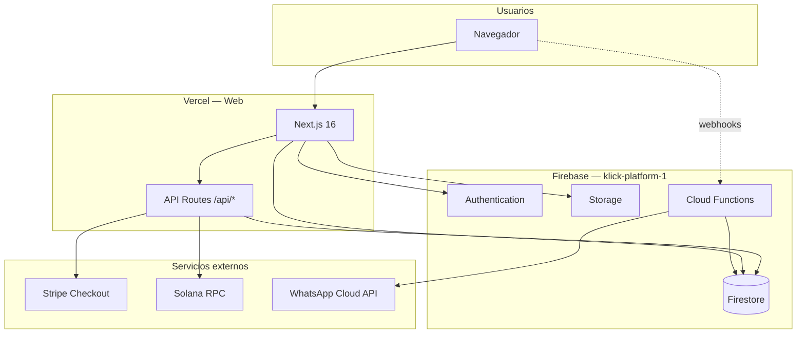

# Visión general del despliegue

## Arquitectura en producción

## Qué corre en cada sitio

### Vercel (aplicación web)

- Páginas marketing: `/`, `/membership/*`, `/instructions-payment-*`, etc.
- Portal y formularios que usan **Firebase Client SDK** en el navegador.
- **API Routes** que necesitan secreto de servidor:
  - `/api/payments/qr/*` — pagos crypto (Firestore Admin + Solana).
  - `/api/whatsapp/send` — envío WhatsApp desde la web.

Build: `npm run build` → salida `.next/`.

### Firebase (datos y automatización)

| Servicio | Uso en Klick |
|----------|-----------------|
| **Firestore** | Órdenes crypto, sesiones QR, datos de aplicación/onboarding, mensajes |
| **Authentication** | `/portal` (email/password) |
| **Storage** | Subidas de archivos (hooks, formularios) |
| **Cloud Functions** | Webhooks WhatsApp, Google Forms, callables, kanban |
| **Hosting (opcional)** | `firebase.json` tiene `frameworksBackend` — alternativa a Vercel para el mismo Next |

Región Firestore configurada: **nam5** (ver `firebase.json`).

### Firebase Studio / IDX

- Entorno de desarrollo en la nube (`.idx/dev.nix` → `npm run dev`).
- Mismo proyecto Firebase `klick-platform-1` para probar Auth y Firestore.
- No sustituye el deploy: es **dev**; producción sigue siendo Vercel + `firebase deploy`.

## Orden recomendado de despliegue (release)

1. **Reglas** Firestore y Storage (`deploy:firebase:rules`) si cambiaron.
2. **Cloud Functions** si cambió `functions/`.
3. **Variables** en Vercel y Firebase Functions (ver [env/README.md](./env/README.md)).
4. **Web** en Vercel (git push o deploy manual).
5. Smoke test: home, plan básico, crear QR crypto, portal login.

## Entornos

| Entorno | Web | Firebase project | Notas |
|---------|-----|------------------|-------|
| Local | `localhost:3000` | Mismo proyecto o emuladores | `serviceAccountKey.json` o env Admin |
| Producción | `klick-land.vercel.app` (ej.) | `klick-platform-1` | Env en Vercel Dashboard |

Ideal a futuro: proyecto Firebase `klick-staging` para pruebas (hoy solo `production` en `.firebaserc`).
