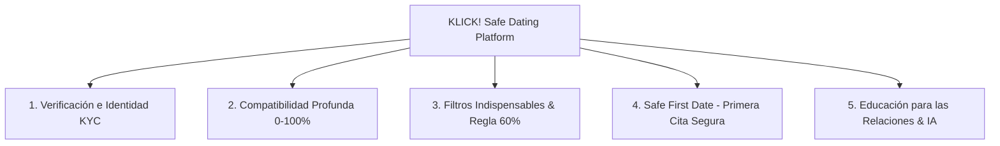
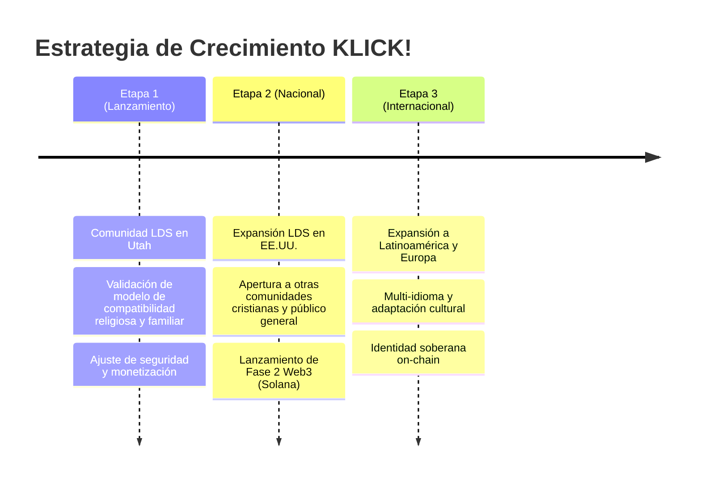

# 💘 KLICK! — Resumen Ejecutivo del Proyecto

> **Empresa:** SafeMeet.Ut LLC  
> **Nombre Comercial:** KLICK!  
> **Fundador y CEO:** Juan Carlos Llumipanta  
> **Mercado Inicial:** Comunidad LDS (Santos de los Últimos Días) de Utah  
> **Expansión Prevista:** Estados Unidos → Mercado Internacional  

---

## 1. Declaración de la Visión

**KLICK!** nace con una misión primordial: **crear un espacio de citas y relaciones más seguro, verificado, compatible y centrado en relaciones duraderas y saludables**.

Las plataformas tradicionales de citas presentan problemas crónicos:
- Perfiles falsos y cuentas duplicadas (catfishing).
- Falta de verificación real de identidad y edad.
- Estafas financieras y emocionales (romance scams).
- Expectativas y valores desalineados entre usuarios.
- Ausencia de medidas de seguridad activas en la vida real (primeras citas).

**KLICK! transforma esta experiencia combinando:**
$$\text{Seguridad Activa} + \text{Verificación KYC} + \text{Algoritmo de Compatibilidad Profunda (0--100\%)} + \text{Educación Relacional} + \text{Safe First Date}$$

> **Filosofía Fundamental:**  
> *"No solamente queremos ayudarte a encontrar a alguien; queremos ayudarte a encontrar a la persona adecuada y a construir una relación sólida, saludable y duradera."*

---

## 2. Los 5 Pilares Diferenciadores

### 1. Verificación e Identidad Real
- Verificación de identidad con documento oficial + selfie liveness (anti-suplantación).
- Verificación obligatoria de edad (+18) y validación de teléfono/email por OTP.
- Transparencia absoluta: la aplicación distingue con claridad los **datos verificados** de los **datos declarados**.

### 2. Algoritmo de Compatibilidad Multidimensional (0–100%)
No nos limitamos a la geolocalización o a fotos superficiales. El algoritmo evalúa 10 categorías ponderadas:
- ⛪ **Fe y Valores LDS** (Importancia de la Iglesia, Temple Recommend, Misión).
- 💍 **Matrimonio y Objetivos** (Deseo de matrimonio en el templo, plazos).
- 👨‍👩‍👧 **Familia e Hijos** (Hijos actuales, planes de tener hijos, aceptación de pareja con hijos).
- 🌎 **Idioma y Cultura** (Idiomas hablados, contexto cultural).
- 🛡️ **Seguridad y Confianza** (Nivel de verificación, historial).
- 📍 **Distancia** (Ubicación aproximada, disposición a mudarse).
- 🏃 **Estilo de Vida y Rutina** (Trabajo, estudio, nivel de actividad).
- ❤️ **Compatibilidad y Personalidad** (Estilo de comunicación, metas de vida).
- 🎯 **Intereses y Hobbies** (Pasatiempos, deportes, culinaria, literatura).
- ☕ **Preferencias de Primera Cita** (Ambientes preferidos, seguridad diurna/pública).

### 3. Filtros Indispensables & Regla del 60%
- **Filtros Indispensables (Hard Compatibility Gates):** Si un usuario marca un requisito como *"Indispensable"* (ej. deseo de matrimonio en el templo o no fumar) y el otro no cumple, **el perfil se excluye automáticamente**, sin importar si tiene un 95% en otras áreas.
- **Umbral del 60%:** Para habilitar la interacción o match, el puntaje ponderado debe ser **$\ge 60\%$**.
- **Common Ground (Puntos de Encuentro):** Se destacan entre 3 y 7 coincidencias reales autorizadas para iniciar conversaciones significativas.

### 4. Protocolo "Safe First Date" (Primera Cita Segura)
Convierte la seguridad en una función activa del producto:
- Sugerencia automática de lugares públicos y horarios diurnos de bajo riesgo.
- Registro privado del plan de cita (hora, lugar, contacto de emergencia de confianza).
- Sistema de Check-in antes, durante y después del encuentro.
- Protección estricta de geolocalización: **nunca se comparte la dirección exacta ni la ubicación en tiempo real pública**.

### 5. Educación para las Relaciones & Asistente IA Responsable
- Módulos educativos sobre relaciones saludables, comunicación asertiva, resolución de conflictos, límites personales, superación de infidelidad, hábitos inapropiados y finanzas en pareja.
- **IA Asistente con Guardrails estrictos:** Asiste como coach de conversación y explicación de compatibilidad basada únicamente en datos autorizados; **no realiza diagnósticos clínicos ni emite juicios acusatorios**.

---

## 3. Mercado Inicial y Estrategia de Expansión

1. **Etapa 1 — Utah (Nicho Inicial LDS):**
   - Construir una comunidad sólida, segura y de alta reputación dentro de los Santos de los Últimos Días en Utah.
   - Atributos clave: Misión, Temple Recommend, matrimonio eterno, valores familiares.
2. **Etapa 2 — Expansión Nacional (Estados Unidos):**
   - Expandir a congregaciones LDS fuera de Utah (Idaho, Arizona, California, Texas) y extender el motor de compatibilidad a otras comunidades con valores afines.
3. **Etapa 3 — Expansión Internacional:**
   - Lanzamiento en mercados de habla hispana e internacional con soporte multi-idioma y modelos de identidad descentralizada.

---

## 4. Modelo de Negocio y Monetización

| Segmento | Acceso Gratuito | Funciones Premium / Monetizadas |
| :--- | :--- | :--- |
| **Mujeres** | ✅ **Acceso 100% Gratuito** a todas las funciones básicas y de interacción | Servicios VIP opcionales / Boosts |
| **Hombres** | ✅ Registro, verificación, creación de perfil, búsqueda y visualización de compatibilidad básica (Score y Common Ground) | 💳 **Suscripción Premium / Pago por interacción**: Iniciar chats, desbloquear detalles profundos (fe detallada, matrimonio, educación), filtros avanzados |

> **Nota:** La lógica de acceso (*entitlements*) se valida estrictamente en el **servidor (backend)** para garantizar que ninguna API exponga datos restringidos sin suscripción activa.

---

## 5. Indicadores Clave de Rendimiento (KPIs)

A diferencia de las aplicaciones tradicionales orientadas a maximizar el tiempo en pantalla ("swipe infinito"), KLICK! prioriza **la calidad y la seguridad de las relaciones**:

1. **Tasa de Verificación:** $\%$ de perfiles con KYC aprobado ($> 85\%$).
2. **Completitud de Perfiles:** $\%$ de usuarios con cuestionario de compatibilidad completo ($> 90\%$).
3. **Calidad de Conexiones Klick:** Compatibilidad media de conexiones iniciadas ($> 72\%$).
4. **Conversión a Citas Seguras:** Número de citas coordinadas mediante el protocolo *Safe First Date*.
5. **Métricas de Trust & Safety:** Tasa de reportes por usuario, tiempo de respuesta a incidentes ($< 15$ min en alertas críticas) y cero tolerancia a cuentas falsas.
