# 🚀 KLICK! — Documento de Alcanzables y Entregables por Fases

Este documento define el **alcance exacto (Scope of Work)**, los módulos técnicos, entregables y criterios de aceptación para el desarrollo y despliegue de **KLICK!** en sus dos fases estratégicas.

---

## 🎯 Enfoque Estratégico: Desarrollo en 2 Fases

> **Principio de Continuidad:**  
> La interfaz y experiencia de usuario construidas en el frontend permanecen uniformes. En la transición a la Fase 2, **cambiamos la capa de identidad y valor (Web3)** sin reescribir la aplicación ni degradar la velocidad y privacidad de los usuarios.

```mermaid
graph LR
    subgraph Fase1["Fase 1: Web2 (Lanzamiento Inmediato)"]
        F1A["Google Cloud / Firebase Stack"]
        F1B["Firebase Auth + Firestore"]
        F1C["Stripe Checkout & Subscriptions"]
        F1D["Motor de Compatibilidad 0-100%"]
        F1E["Safe First Date + KYC"]
    end

    subgraph Fase2["Fase 2: Web3 Solana (Identidad & Valor)"]
        F2A["Solana Wallets (Phantom/Solflare)"]
        F2B["Anchor Program + User PDAs"]
        F2C["USDC Pagos / Membresías On-Chain"]
        F2D["Metadata Descentralizada (Arweave/IPFS)"]
        F2E["Chat y Privacidad Off-Chain Protegidos"]
    end

    Fase1 -->|Evolución Modular| Fase2
```

---

## 📦 FASE 1: Web2 — Stack Google Cloud / Firebase (MVP Completo)

En esta fase se entrega un producto 100% funcional, seguro, escalable y con cumplimiento normativo estricto (privacidad, eliminación de cuenta, reportes y derecho al olvido).

### Matriz de Capas e Infraestructura Fase 1

| Capa | Servicio / Herramienta | Función y Ubicación de Datos |
| :--- | :--- | :--- |
| **Repositorio & CI/CD** | **GitHub + GitHub Actions** | Control de versiones, pruebas automatizadas y pipelines de despliegue continuo. |
| **Diseño y Frontend** | **Next.js + Tailwind CSS + shadcn/ui + Capacitor (Móvil)** | Interfaz web responsiva y compasión nativa iOS/Android vía Capacitor. |
| **Backend & APIs** | **Cloud Functions / Cloud Run (Node.js/TypeScript)** | Lógica de negocio, matching determinista, moderación y webhooks. |
| **Autenticación** | **Firebase Authentication** | Email/password, Google Sign-In, Apple ID y verificación SMS (OTP). |
| **Base de Datos** | **Cloud Firestore** | Perfiles, cuestionarios de compatibilidad, likes, matches y estados de seguridad. |
| **Almacenamiento Multimedia** | **Cloud Storage + CDN** | Fotos de perfil y evidencias de verificación (cifrado en reposo). |
| **Chat en Tiempo Real** | **Cloud Firestore / Realtime DB** | Mensajería privada y cifrada en tránsito entre matches autorizados. |
| **Motor de Conexión Klick** | **Cloud Functions + Índices Firestore** | Cálculo de compatibilidad (0–100%), regla del 60% y Common Ground. |
| **Notificaciones Push** | **Firebase Cloud Messaging (FCM)** | Alertas instantáneas de matches, mensajes, recordatorios y *Safe First Date*. |
| **Moderación & Seguridad** | **Vertex AI + Reglas de Moderación Humana** | Análisis de imágenes, biografía y texto; cola de moderación y reportes. |
| **Pasarela de Pagos** | **Stripe Billing / Checkout** | Suscripciones mensuales/anuales y cobros para hombres; mujeres gratis. |
| **Analítica de Producto** | **Google Analytics 4 + BigQuery** | Funnels de onboarding, retención y métricas de seguridad anonimizadas. |
| **Gestión de Secretos** | **Google Secret Manager / Vercel Env** | Claves de API y certificados protegidos fuera del repositorio. |

---

### 📋 Módulos Alcanzables y Entregables de la Fase 1

#### 1. Módulo de Onboarding y Perfil de Usuario (`DEV-001`, `DEV-002`, `DEV-003`)
- [x] **Registro y Cuenta (`REG-001` a `REG-004`):** Email, teléfono (OTP), fecha de nacimiento y verificación de mayoría de edad.
- [x] **Perfil y Media (`REG-005` a `REG-007`):** Nombre público, fotos con validación de calidad/moderación y ubicación aproximada (ciudad/código postal; **nunca coordenadas exactas**).
- [x] **Cuestionario Multidimensional (`REG-008` a `REG-017`):** Fe LDS (asistencia, Temple Recommend, misión), matrimonio y familia, trabajo, educación, hobbies, metas y preferencias de primera cita.
- [x] **Gestión de Privacidad Server-Side:** Los campos restringidos (fe detallada, matrimonio, educación) solo se sirven a clientes autorizados (Premium / Entitled).

#### 2. Módulo de Filtros y Búsqueda Avanzada (`01_Filtros_Busqueda`)
- [x] **Filtros F-001 a F-031:** Configuración de preferencias en Fe, Idioma, Familia, Matrimonio, Distancia, Estilo de Vida, Metas, Hobbies y Cita Segura.
- [x] **Ponderación de Preferencias:** Cada filtro puede ser catalogado por el usuario como:
  1. *Indispensable* (Hard Filter).
  2. *Preferido* (Suma al score ponderado).
  3. *Me es indiferente* (No afecta el cálculo).

#### 3. Motor de Compatibilidad y Regla del 60% (`DEV-006` a `DEV-010`, `03_Match_60_Porcentaje`)
- [x] **Puerta 1 (Hard Safety Gate):** Excluye inmediatamente si algún usuario está bloqueado, reportado o no verificado.
- [x] **Puerta 2 (Hard Compatibility Gate):** Si un requisito marcado como *Indispensable* no coincide, el candidato es **excluido de inmediato** (sin importar el puntaje global).
- [x] **Puerta 3 (Filtro de Distancia Máxima):** Exclusión si la distancia aproximada supera el radio configurado.
- [x] **Cálculo de Score Ponderado (0–100%):** Suma ponderada de las 10 categorías normalizadas:
  $$\text{Score Global} = \frac{\sum (\text{Score Categoría} \times \text{Peso})}{\sum \text{Pesos}}$$
- [x] **Puerta 4 (Umbral del 60%):** Si $\text{Score} < 60\%$, se bloquea la conexión; si $\text{Score} \ge 60\%$, pasa a la etapa de conexión y Common Ground.
- [x] **Módulo de Common Ground:** Extracción automática de **3 a 7 coincidencias reales** entre perfiles autorizados (ej. *Ambos hablan español, disfrutan hiking y buscan matrimonio en el templo*).

#### 4. Módulo "Safe First Date" (Primera Cita Segura) (`DEV-014`, `08_Safe_First_Date`)
- [x] **Sugerencias de Lugares Públicos:** Catálogo de cafés, restaurantes y actividades diurnas seguras.
- [x] **Registro Privado del Plan:** Fecha, hora, lugar y contacto de confianza opcional (almacenado de forma segura).
- [x] **Sistema de Check-in:** Notificación previa a la cita, botón de confirmación de llegada segura y retroalimentación post-cita.
- [x] **Acciones Inmediatas:** Botón de reporte y bloqueo accesible en todo momento durante el proceso.

#### 5. Módulo de Suscripciones y Monetización (`DEV-011`, `DEV-012`, `05_Suscripcion_Acceso`)
- [x] **Regla de Acceso Femenino:** Las mujeres tienen acceso gratuito completo validado en backend.
- [x] **Modelo Masculino:**
  - *Gratis:* Explorar perfiles, ver fotos principales, ver score de compatibilidad y puntos de encuentro básicos.
  - *Premium (Stripe):* Iniciar conversaciones por chat, ver detalles profundos de fe/matrimonio/hobbies y filtros avanzados.

#### 6. Módulo Trust & Safety y Moderación (`DEV-013`, `DEV-017`, `DEV-018`, `06_Seguridad`)
- [x] **Bloqueo y Reportes:** Bloqueo instantáneo mutuo y generación de tickets con motivo y evidencia para revisión.
- [x] **Moderación Automática:** Análisis de contenido con Vertex AI para prevenir fotos inapropiadas o lenguaje ofensivo.
- [x] **Panel de Administración RBAC:** Control de acceso basado en roles con autenticación de dos factores (MFA) y logs de auditoría inmutables.

---

## ⚡ FASE 2: Web3 en Solana (Evolución Híbrida & Propiedad Digital)

Cuando el producto Web2 alcance tracción y validación de usuarios, se activará la capa Web3 para dotar a los usuarios de **identidad soberana, pagos transparentes y portabilidad de perfil**, manteniendo la privacidad y seguridad crítica off-chain.

### Matriz de Capas e Infraestructura Fase 2

| Componente Web3 | Tecnología | Qué pasa con los datos |
| :--- | :--- | :--- |
| **Identidad Soberana** | **Solana Wallet Adapter** (Phantom, Solflare, Backpack) | El usuario puede autenticarse con su wallet o vincularla a su cuenta Web2. |
| **Perfil On-Chain** | **Programa Anchor en Solana + PDA de Usuario** | Almacena ID único, estado de verificación, membresías activas, reputación y flags públicos. |
| **Metadata Descentralizada** | **Arweave / Irys / IPFS** | Bio pública, intereses autorizados y foto de portada anclados vía CID inmutable. |
| **Datos Sensibles & Privados** | **Cloud Firestore / Storage Cifrado (Off-Chain)** | Fotos privadas, chats, geolocalización exacta y datos KYC **permanecen estrictamente fuera de la blockchain**. |
| **Chat & Mensajería** | **Off-Chain Seguro / (Opcional: Protocolo XMTP)** | Las conversaciones personales nunca se publican en un ledger público. |
| **Pagos en Criptoactivos** | **USDC en Solana / Solana Pay** | Suscripciones mensuales y boosts pagados con comisiones mínimas (<$0.001) y confirmación en segundos. |
| **Tokens / Membresías NFT** | **Token SPL / Compressed NFTs (cNFTs)** | Pases de membresía VIP, insignias de eventos de la comunidad o beneficios transferibles. |
| **Indexación y Rendimiento** | **Helius / Triton RPC Nodes** | Indexación en tiempo real para que la app mantenga velocidad nativa sin latencia de red. |

---

### 🛡️ Declaración de Privacidad y Cumplimiento Legal en Web3

> **Frase de Cara al Usuario y Entidades Regulatorias:**  
> *"Lo público y portable (identidad, reputación, membresías) vive en Solana y almacenamiento descentralizado bajo el control del usuario. Todo lo íntimo y sensible (chats, fotos privadas, reportes de seguridad y ubicación) permanece en infraestructura segura y controlada, garantizando el cumplimiento de leyes de privacidad (CCPA, GDPR) y protección a víctimas de acoso o estafas."*
