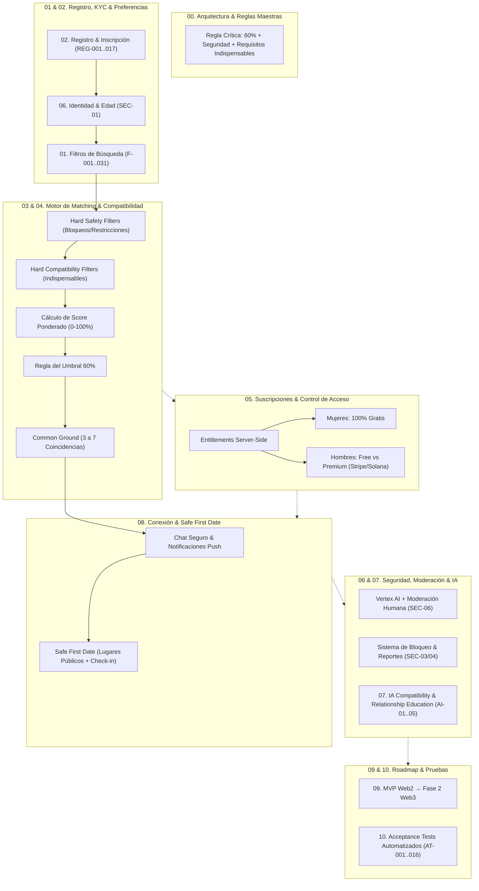
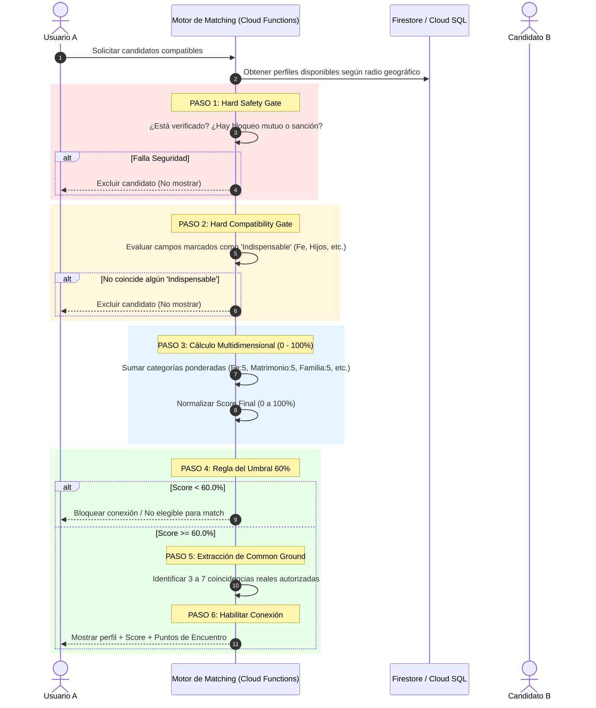
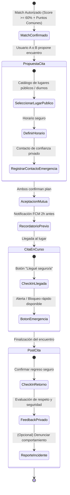
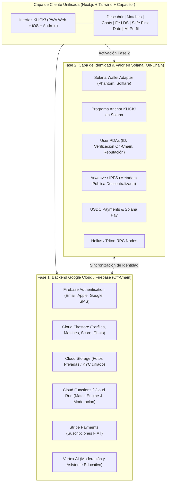
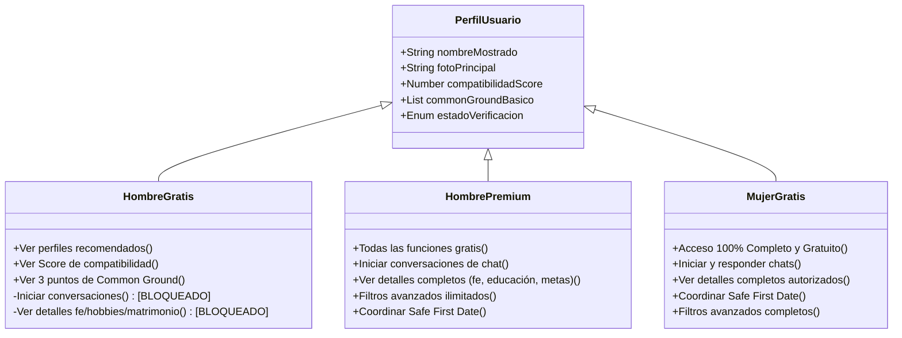

# 📊 KLICK! — Diagramas de Funciones, Flujos y Arquitectura

Este documento consolida todos los diagramas técnicos y funcionales de **KLICK!**, estructurados con sintaxis [Mermaid](https://mermaid.js.org/) para su renderizado nativo en Markdown y herramientas visuales.

---

## 1. Diagrama General de Módulos Funcionales (00 a 10)

---

## 2. Flujo Completo del Motor de Matching (Pipeline de 6 Pasos)

---

## 3. Protocolo "Safe First Date" (Primera Cita Segura)

---

## 4. Arquitectura de Transición: Fase 1 (Web2) vs Fase 2 (Web3 Solana)

---

## 5. Matriz de Acceso y Entitlements de Usuario

