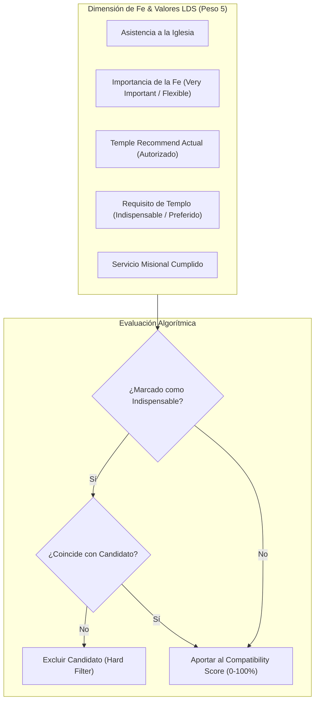

# ⛪ KLICK! — Guía de Producto, Valores y Comunidad LDS

> **Enfoque:** Especificación Cultural, Religiosa y Familiar para el Mercado de Utah y Expansión.  
> **Comunidad:** Santos de los Últimos Días (LDS) y Familias con Principios Cristianos.  

---

## 1. Contexto y Oportunidad en la Comunidad LDS de Utah

En la comunidad LDS (Santos de los Últimos Días), el noviazgo y el matrimonio poseen una trascendencia espiritual y familiar fundamental. A diferencia de las plataformas convencionales orientadas a encuentros casuales o efímeros, los solteros LDS buscan **propósito, fidelidad, metas eternas y alineación en valores esenciales**.

### Factores Críticos para el Usuario LDS:
1. **Deseo de Matrimonio en el Templo:** Alineación en la meta del sellamiento en el templo.
2. **Recomendación para el Templo (Temple Recommend):** Indicador de observancia y devoción personal.
3. **Servicio Misional:** Haber servido una misión de tiempo completo o apoyar la obra misional.
4. **Asistencia a la Iglesia y Participación Activa:** Importancia de los domingos, llamamientos y vida de barrio/estaca.
5. **Familia y Crianza:** Visión compartida sobre el número de hijos, educación en el hogar y roles familiares.
6. **Normas de Conducta y Pureza:** Respeto mutuo, lenguaje limpio y estándares morales acordes al Evangelio.

---

## 2. Implementación en el Algoritmo de Compatibilidad

El motor de **KLICK!** evalúa la compatibilidad en Fe y Valores LDS con un **peso prioritario (Peso: 5/6)** dentro del modelo de 10 categorías:

---

## 3. Catálogo de Preguntas y Respuestas en Perfil LDS

| Categoría | Pregunta en Onboarding | Opciones Disponibles | Tratamiento de Privacidad |
| :--- | :--- | :--- | :--- |
| **Fe Principal** | ¿Cuál es tu fe / tradición religiosa? | `LDS (Santos de los Últimos Días)`, `Cristiano`, `Otro`, `Prefiero no indicar` | Visible en Perfil |
| **Importancia** | ¿Qué importancia tiene la Iglesia en tu vida diaria? | `Muy Importante`, `Importante`, `Moderada`, `Flexible` | Usado en Matching |
| **Templo** | ¿Cuentas con Recomendación para el Templo activa? | `Sí`, `En proceso`, `No`, `Prefiero no indicar` | Controlado / Privado |
| **Meta Matrimonial** | ¿Es indispensable el matrimonio en el templo? | `Indispensable`, `Deseado / Preferido`, `Abierto / No indispensable` | Hard Filter Server-Side |
| **Misión** | ¿Serviste una misión de tiempo completo? | `Sí (Nacional)`, `Sí (Internacional)`, `No serví`, `Servicio honorable` | Common Ground |
| **Hijos y Familia** | ¿Cuántos hijos deseas tener en el futuro? | `1–2`, `3–4`, `5 o más`, `Abierto a lo que venga`, `No deseo hijos` | Comparación Directa |

---

## 4. Educación para las Relaciones: Enfoque Integral

KLICK! incorpora módulos educativos para fortalecer a los solteros antes y durante el noviazgo:
- **Comunicación en Pareja:** Escucha activa, resolución pacífica de diferencias y empatía.
- **Finanzas y Metas Comunes:** Planificación económica, autosuficiencia y transparencia.
- **Superación de Hábitos Inapropiados:** Guías y recursos sobre pureza moral, límites personales y recuperación de la confianza.
- **Transición al Matrimonio:** Cómo identificar señales positivas (*Green Flags*) y señales de advertencia (*Red Flags*).
