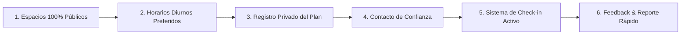
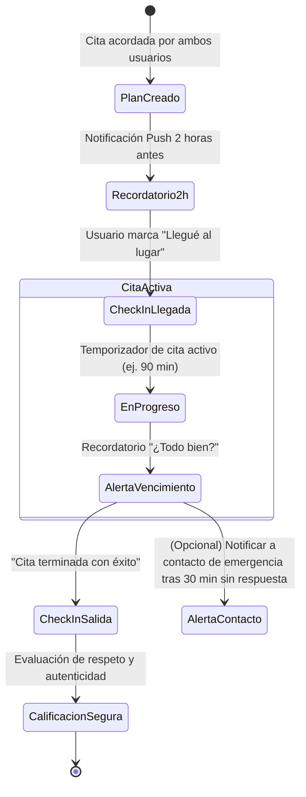

# 🛡️ KLICK! — Manual Operativo y Protocolo "Safe First Date"

> **Objetivo:** Proteger a los usuarios durante la transición de la interacción digital al encuentro presencial en el mundo real.  
> **Área:** Trust & Safety y Experiencia de Usuario.  

---

## 1. Los 6 Principios del Protocolo Safe First Date

1. **Lugares Públicos Validados:** Cafés, restaurantes concurridos, paseos peatonales y centros comunitarios con alta afluencia de personas.
2. **Horarios de Bajo Riesgo:** Recomendación activa de encuentros diurnos o en primeras horas de la tarde.
3. **Privacidad de Ubicación:** Nunca se comparte en la app la dirección residencial de ningún usuario ni coordenadas en tiempo real a extraños.
4. **Ángel Guardián (Contacto de Confianza):** Posibilidad de designar a un amigo o familiar que recibirá un enlace privado y cifrado con los detalles del encuentro si el usuario no realiza el check-in.
5. **Check-In Bidireccional:** Confirmación de "Llegué a salvo" y "Cita finalizada con éxito".
6. **Reporte Rápido In-App:** Botón discreto de asistencia y bloqueo inmediato en caso de conducta inapropiada.

---

## 2. Catálogo de Lugares Recomendados para Utah

| Zona / Ciudad | Tipo de Lugar | Ejemplo de Ambiente Seguro |
| :--- | :--- | :--- |
| **Salt Lake City** | Cafés & Plazas | *City Creek Center*, *Sugar House Coffee*, *Memory Grove Park* |
| **Provo / Orem** | Heladerías & Paseos | *Riverwoods Mall*, *Provo River Trailway*, *Rockwell Ice Cream* |
| **Lehi / Draper** | Gastronomía & Centros | *Thanksgiving Point Gardens*, *Outlets at Traverse Mountain* |
| **Ogden** | Histórico & Público | *Historic 25th Street*, *Eccles Art Center* |
| **St. George** | Parques & Cafés | *Town Square Park*, *FeelLove Coffee* |

---

## 3. Diagrama de Estado del Check-In

---

## 4. Respuestas ante Incidentes (Escalabilidad de Seguridad)

- **Comportamiento Inapropiado Leve:** Calificación privada negativa $\rightarrow$ El algoritmo reduce la visibilidad del perfil infractor.
- **Suplantación de Identidad o Información Falsa:** Suspensión preventiva de la cuenta $\rightarrow$ Solicitud obligatoria de re-verificación biométrica KYC.
- **Amenazas o Acoso:** Bloqueo permanente e irreversible del UID, número telefónico y dispositivo (device fingerprint ban), con preservación de logs auditables para soporte legal si la víctima lo solicita.
