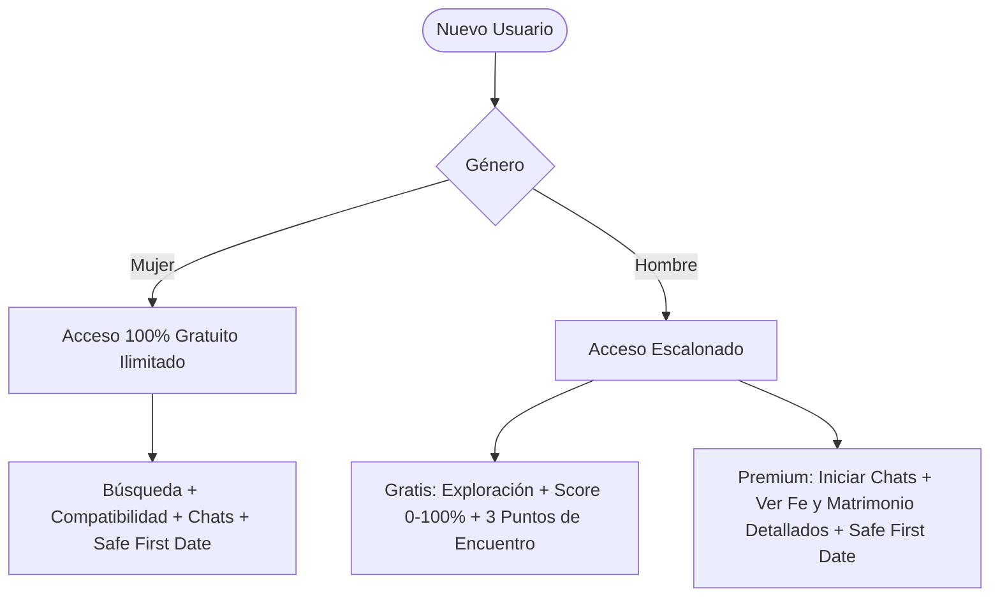

# 💰 KLICK! — Modelo de Negocio, Monetización y Unit Economics

> **Empresa:** SafeMeet.Ut LLC  
> **Estrategia Comercial:** Red de Dos Lados (Two-Sided Marketplace) con Acceso Femenino Gratuito y Monetización Masculina Basada en Interacción y Valor.  

---

## 1. Fundamentos de la Estrategia de Monetización

Para que una plataforma de citas y relaciones prospere, requiere **liquidez de usuarios, alta proporción de perfiles femeninos auténticos y una comunidad libre de spam**.

### Estructura de Acceso por Género



---

## 2. Planes y Tarifas Oficiales (Fase 1 Web2 vs Fase 2 Web3)

| Plan / Función | Precio Fase 1 (Stripe USD) | Precio Fase 2 (Solana USDC) | Beneficios Clave |
| :--- | :---: | :---: | :--- |
| **Membresía Básica (Hombres)** | **$19.99 / mes** | **18.00 USDC / mes** | Verificación KYC, búsqueda con filtros completos, visualización de Common Ground ilimitado. |
| **Membresía Premium (Hombres)** | **$39.99 / mes** | **35.00 USDC / mes** | Conversaciones ilimitadas, desbloqueo de fe detallada/matrimonio, coordinación *Safe First Date*. |
| **Experiencia VIP (Anual / Boost)** | **$199.00 / año** | **180.00 USDC / año** | Perfil destacado en el área metropolitana de Utah, 5 boosts mensuales, asesoría relacional IA. |
| **Mujeres (Todas las funciones)** | **$0.00 (Gratis)** | **0.00 USDC (Gratis)** | Acceso completo de por vida a la plataforma. |

> **Ventaja de la Fase 2 (Web3 Solana):**  
> Al migrar a pagos en **USDC sobre Solana**, la comisión por transacción se reduce del $\approx 3.5\% + \$0.30$ (Stripe) a **$<\$0.001$ por transacción** y liquidación instantánea en la tesorería de la empresa.

---

## 3. Embudo de Conversión (Funnel) y Métricas Objetivo

```mermaid
funnel
    title Embudo de Conversión KLICK!
    "1. Registro & Onboarding" : 100
    "2. Verificación KYC Aprobada" : 85
    "3. Cuestionario de Compatibilidad Completo" : 75
    "4. Primer Klick! Compatible (Score >= 60%)" : 55
    "5. Conversión a Suscripción Premium (Hombres)" : 18
    "6. Coordinación de Safe First Date" : 12
```

### Indicadores Financieros Clave (Unit Economics)
- **CAC (Costo de Adquisición de Cliente):** Objetivo $<\$12.00$ por usuario verificado en Utah mediante marketing comunitario y referidos.
- **LTV (Lifetime Value Masculino):** Estimado en $\$140.00$ (promedio de 3.5 meses de suscripción activa).
- **Ratio LTV / CAC:** **$> 10x$**, garantizando alta rentabilidad y flujo de caja sostenible.
