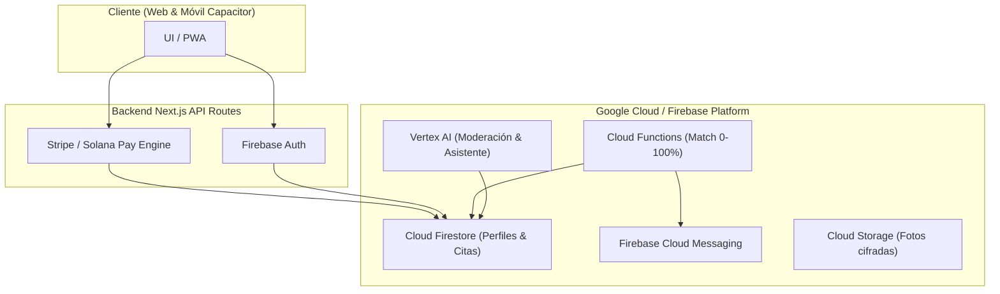

# 🏛️ Arquitectura del Sistema KLICK!

> **Empresa:** SafeMeet.Ut LLC  
> **Producto:** KLICK! Dating & Relationship Platform  
> **Stack:** Next.js (App Router) + Firebase + Tailwind CSS / shadcn/ui + Capacitor + Stripe + Solana (Fase 2)

---

## 1. Principio de Organización y Estructura del Repositorio

El repositorio está estructurado con una clara **separación lógica por responsabilidades**:

```
klick/
├── deploy/                        # Guías y configuración de despliegue: Vercel, Firebase, env
├── docs/                          # Documentación ejecutiva, técnica, diagramas y especificación
├── functions/                     # Backend serverless Firebase: Matching engine, notificaciones FCM
├── public/                        # Assets estáticos, logos y multimedia
├── src/
│   ├── app/                       # CAPA DE RUTAS (Next.js App Router)
│   ├── backend/                   # CAPA SERVIDOR: Pagos, Firebase Admin, Entitlements
│   ├── frontend/                  # Módulos UI organizados y secciones experimentales
│   ├── components/                # Biblioteca UI compartida (landing, membership, shadcn/ui)
│   ├── hooks/                     # Custom React Hooks
│   └── lib/                       # Utilidades cliente, validación Zod y helpers de pagos
└── firebase.json, firestore.rules, storage.rules
```

---

## 2. Capas del Sistema y Responsabilidades

### A. Capa de Rutas (`src/app/`)

| Ruta | Módulo / Función |
| :--- | :--- |
| `/` | Landing page principal de KLICK! (propuesta de valor, compatibilidad, testimonios, CTA) |
| `/membership/basic` | Landing de Membresía Básica y Verificación de Identidad |
| `/membership/vip` | Landing de Membresía VIP y Experiencia de Matching Completa |
| `/instructions-payment-basic` | Checkout e instrucciones de pago para Membresía Básica (Stripe / Solana QR) |
| `/instructions-payment-vip` | Checkout e instrucciones de pago para Membresía VIP (Stripe / Solana QR) |
| `/education` | Módulo de Educación para las Relaciones y Citas Saludables |
| `/safe-dates` | Guía y catálogo de lugares públicos y seguros para *Safe First Date* |
| `/guides` | Guías de seguridad, comunicación y citas en la comunidad |
| `/features` | Catálogo de funciones: KYC, Algoritmo 0–100%, Common Ground, Safe First Date |
| `/portal` | Portal privado del usuario autenticado (perfil, estado de membresía, recursos) |
| `/portal/membresia-basica` | Área de usuario con membresía básica activa |
| `/portal/membresia-vip` | Área de usuario con membresía VIP activa |
| `/application/[id]` | Formulario de registro y cuestionario de compatibilidad |
| `/onboarding/[id]` | Flujo de bienvenida y verificación de perfil |
| `/api/payments/qr/*` | Endpoints backend para pagos en criptoactivos (Solana Pay / USDC / LXR) |

---

### B. Capa de Servidor (`src/backend/`)

| Archivo / Carpeta | Responsabilidad |
| :--- | :--- |
| `firebase/admin.ts` | Inicialización de Firebase Admin SDK con credenciales de servicio |
| `payments/payment-config.ts` | Catálogo de precios USD/Crypto, configuración de wallets y tokens SPL |
| `payments/firestore-schema.ts` | Esquemas tipados de sesiones de pago, comprobantes y transacciones |
| `payments/qr-payment.ts` | Generación de sesiones y códigos QR Solana Pay |
| `payments/verify-payment.ts` | Verificación server-side de firmas de transacción en la blockchain |

---

### C. Biblioteca de Componentes (`src/components/`)

- `landing/`: Componentes de marketing (Hero, Header, Footer, BasicPlanShowcase, VipPlanShowcase, KlickStoriesShowcase, Roadmap).
- `payments/`: Componentes interactivos de checkout (CryptoCheckoutPanel, BrandedQrCode, BookCheckoutFlow, instructions-payment-ui).
- `ui/`: Componentes base accesibles de diseño (shadcn/ui, Radix UI).

---

## 3. Flujo de Datos y Pipeline de Matching



---

## 4. Convenciones de Desarrollo

1. **Lógica de Servidor Estricta:** Toda validación de entitlements, cobros y moderación se ejecuta en `src/backend/` o `src/app/api/`, nunca en el cliente.
2. **Secciones Modulares:** Cada landing mantiene su carpeta `secciones-ocultar/` para realizar pruebas A/B y activar módulos sin alterar producción.
3. **Privacidad de Geolocalización:** Nunca se almacena ni comparte la dirección exacta ni coordenadas GPS precisas; únicamente ciudad y código postal aproximado.
