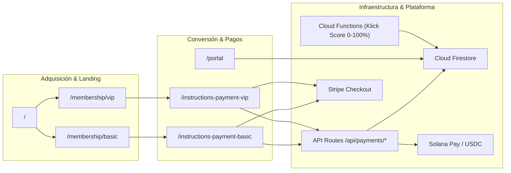

# 💼 KLICK! — Resumen para Inversores y Visión de Negocio

> **Empresa:** SafeMeet.Ut LLC  
> **Producto:** KLICK! Dating & Relationship Platform  
> **Fundador y CEO:** Juan Carlos Llumipanta  
> **Mercado Objetivo:** Comunidad LDS de Utah $\longrightarrow$ Expansión Nacional e Internacional  

---

## 1. Oportunidad de Mercado

El mercado de aplicaciones de citas está saturado de soluciones superficiales basadas en swipes rápidos y perfiles sin verificar, lo que genera:
- Altas tasas de perfiles falsos y desconfianza.
- Estafas y falta de seguridad en encuentros presenciales.
- Bajas tasas de relaciones a largo plazo.

**KLICK! resuelve este problema mediante:**
1. **Verificación KYC Obligatoria:** Perfiles 100% reales.
2. **Motor de Compatibilidad Profunda (0–100%):** Con 10 categorías ponderadas y filtros indispensables.
3. **Protocolo Safe First Date:** Seguridad activa en la primera cita presencial (lugares públicos, horarios diurnos y check-in).
4. **Educación Relacional:** Recursos para construir relaciones duraderas y saludables.

---

## 2. Flujo Principal del Producto

---

## 3. Modelo de Monetización

| Segmento de Usuario | Acceso Gratuito | Funciones Monetizadas / Premium |
| :--- | :--- | :--- |
| **Mujeres** | ✅ **100% Gratuito** en todas las funciones esenciales y chats. | Servicios VIP opcionales y boosts destacados. |
| **Hombres** | ✅ Búsqueda, perfiles básicos, score de compatibilidad y 3 coincidencias de Common Ground. | 💳 **Suscripción Premium / Pago por interacción**: Iniciar chats, desbloquear detalles profundos (fe, matrimonio, educación) y planificar *Safe First Date*. |

---

## 4. Estrategia Tecnológica en 2 Fases

- **Fase 1 (Web2):** Producto completo, rápido y seguro sobre Google Cloud / Firebase + Stripe.
- **Fase 2 (Web3 Solana Híbrido):** Identidad soberana on-chain (Phantom / Solflare), pagos en USDC con costos de transacción mínimos ($<\$0.001$) y reputación portable, **manteniendo los datos sensibles y chats estrictamente off-chain**.
